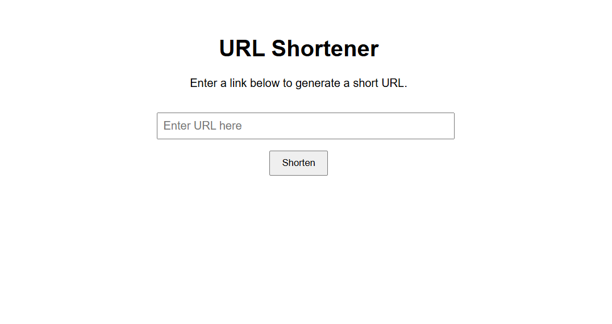

# 🔗 URL Shortener

A simple URL shortener built with **Vite + React + TypeScript** and **Firebase**.  
It allows users to shorten URLs, copy them to the clipboard, and track visit counts.

🔗 **Live Demo:** https://url-shortener-62866.web.app

---

## ✨ Features

- Shorten long URLs
- URL validation
- Copy-to-clipboard
- Visit counter
- Mobile-responsive design
- Firebase Firestore backend

---

## 🛠 Tech Stack

- React + TypeScript + Vite
- Firebase Firestore
- CSS
- react-hot-toast

---

## 📸 Screenshots

### Desktop


### Mobile


---

## 🚀 Getting Started

### Install & Run

```bash
npm install
npm run dev

```

Open in browser:  
http://localhost:5173

## 📄 License
This project is created for educational and portfolio purposes.


